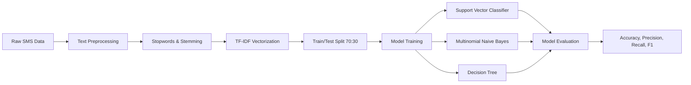

# 📩 SMS & Message Spam Filtering using NLP and Machine Learning

An end-to-end Natural Language Processing (NLP) and Machine Learning project for classifying SMS messages and text communications as **Spam** or **Ham** (legitimate). 

This project explores text preprocessing techniques, TF-IDF feature extraction, and comparative evaluation across multiple machine learning algorithms including **Support Vector Machines (SVM)**, **Multinomial Naive Bayes (MNB)**, and **Decision Trees**.

---

## 🌟 Key Features

- **Text Preprocessing Pipeline**:
  - Punctuation removal using Python string translation.
  - Tokenization and stopword removal via NLTK (`stopwords.words('english')`).
  - Stemming using the NLTK **SnowballStemmer**.
- **Feature Engineering & Vectorization**:
  - TF-IDF Vectorization (`TfidfVectorizer`) to compute term frequency-inverse document frequency matrices.
  - Text feature extraction and serialization (`Text Features.csv`).
- **Multi-Model Benchmark & Evaluation**:
  - **Support Vector Classifier (SVC)** with Sigmoid kernel.
  - **Multinomial Naive Bayes (MultinomialNB)** with Laplace smoothing.
  - **Decision Tree Classifier**.
  - Performance metrics evaluated: **Accuracy**, **Precision**, **Recall**, **F1-Score**, and **Confusion Matrices**.

---

## 📂 Project Structure

```text
├── data/
│   ├── spam.csv                 # SMS Spam Collection dataset (v1: label, v2: message text)
│   └── Text Features.csv        # Preprocessed and engineered text features
├── messageSpamFiltering.ipynb   # Interactive Jupyter Notebook with analysis and experiments
├── messageSpamFiltering.py      # Standalone Python script for training and evaluation
├── Spamtest.txt                 # Sample raw messages used for test inference
├── requirements.txt             # Required Python dependencies
├── .gitignore                   # Git ignore patterns for Python & Jupyter
└── README.md                    # Project documentation
```

---

## 📊 Methodology & Workflow



1. **Data Ingestion**: Load dataset containing labeled SMS messages.
2. **Preprocessing**: Strip punctuation, eliminate common English stopwords, and stem tokens to their root forms using the Snowball algorithm.
3. **Vectorization**: Transform text into TF-IDF numerical vectors to reflect word importance while downweighting frequently occurring generic terms.
4. **Model Training & Comparison**: Train multiple supervised classifiers using a 70/30 train-test split.
5. **Evaluation**: Assess classification reports to identify the optimal model balancing high precision (avoiding false alarms on important messages) and high recall (catching spam).

---

## 🚀 Getting Started

### 1. Clone the Repository
```bash
git clone https://github.com/adii0122/spam-filtering-nlp.git
cd spam-filtering-nlp
```

### 2. Create and Activate a Virtual Environment
```bash
# Windows
python -m venv .venv
.venv\Scripts\activate

# macOS / Linux
python3 -m venv .venv
source .venv/bin/activate
```

### 3. Install Dependencies
```bash
pip install -r requirements.txt
```

### 4. Download NLTK Data
Before running the code, ensure the required NLTK resources are downloaded:
```python
import nltk
nltk.download('stopwords')
nltk.download('punkt')
```

### 5. Run the Project
- **Run the Python Script**:
  ```bash
  python messageSpamFiltering.py
  ```
- **Run the Jupyter Notebook**:
  ```bash
  jupyter notebook messageSpamFiltering.ipynb
  ```

---

## 📦 Requirements

- `jupyter`
- `pandas`
- `nltk`
- `scikit-learn`

---

## 👤 Author

- **Aditya (adii0122)** - [GitHub Profile](https://github.com/adii0122)
